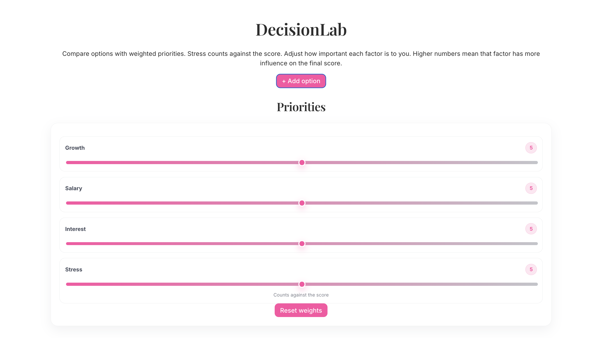
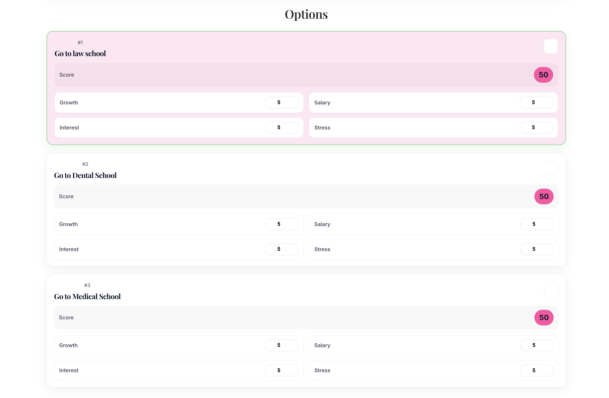

# DecisionLab

A clean, interactive weighted decision-making tool built with React.

DecisionLab helps you compare multiple options using adjustable priorities.  
It calculates a weighted score and highlights the strongest option based on what matters most to you.

---

## Why I Built This

When comparing career paths, projects, or life decisions, it’s easy to rely on emotion alone.  
DecisionLab turns subjective preferences into structured, weighted comparisons.

It demonstrates:
- State management in React
- Derived data computation with `useMemo`
- Controlled form inputs
- Component composition
- Clean UI styling with modern CSS

---

## Features

- Add and remove custom options
- Adjust priority weights (0–10)
- Stress counts negatively in scoring
- Real-time score updates
- Transparent score breakdown
- Clean, modern UI

---

## Scoring Formula

For each option:
score =
(growth × weight_growth) +
(salary × weight_salary) +
(interest × weight_interest) -
(stress × weight_stress)

Higher score = better match based on your priorities.

---

## Tech Stack

- React
- Vite
- JavaScript
- Modern CSS
- useState / useMemo hooks

---

## Run Locally

```bash
npm install
npm run dev

Future Improvements
	•	Persist data to local storage
	•	Save / load decision sets
	•	Visual score breakdown chart
	•	Mobile polish

## Screenshots

### Priorities


### Options


### Recommendation

